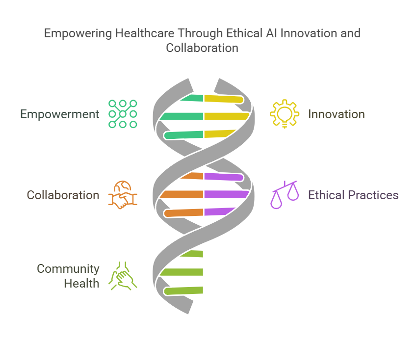
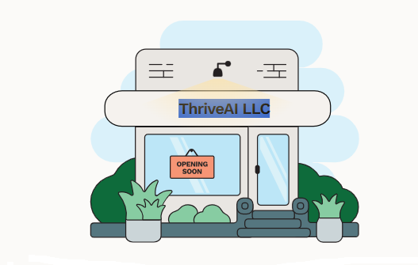
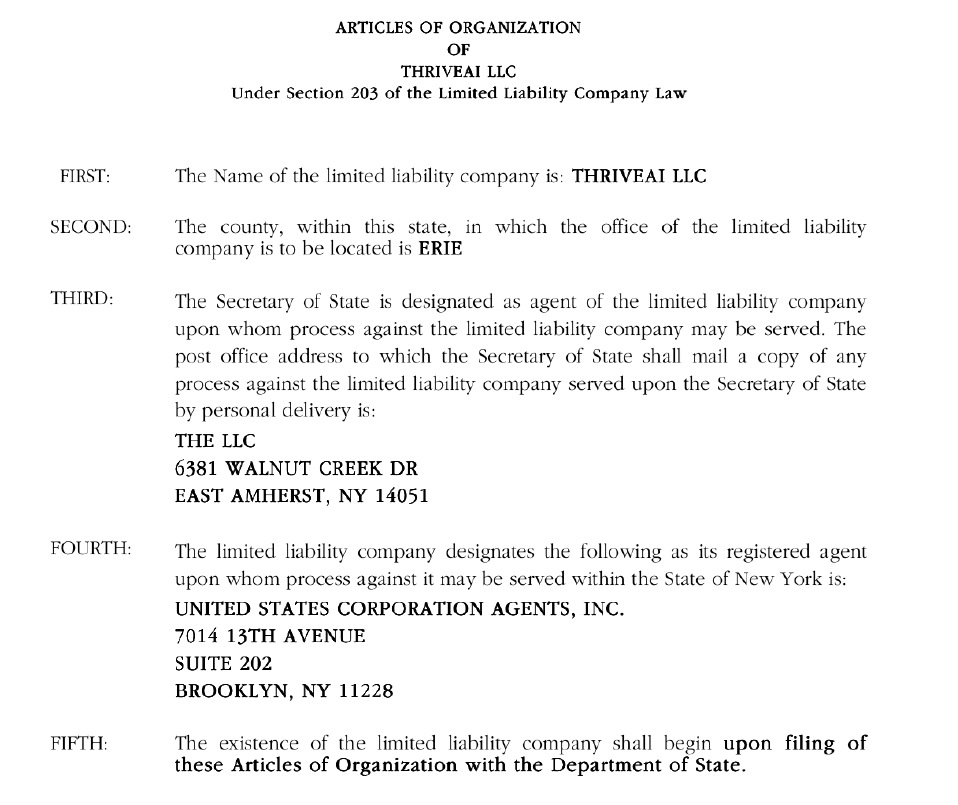

    
# Thriveai 

## Empowering organizations to harness the transformative potential of artificial intelligence

    

    
## Table of Contents

- [Solution Overview](#solution-overview)
- [Who will use this ?](#who-can-use)
- [Advantages of Using](#advantages-of-using)
- [Return on Investment (ROI)](#return-on-investment-roi)
- [How it Works](#how-it-works)
- [Conclusion](#conclusion)
- [Getting Started](#getting-started)
- [Solution Features](#solution-features)
- [Code Features](#code-features)
- [Deliverables or Figures](#deliverables-or-figures)
- [Contact Information](#contact-information)

## ThriveAI Mission Statement

At ThriveAI, our mission is to empower organizations to harness the transformative potential of artificial intelligence, driving innovation and excellence in the healthcare industry and beyond. By leveraging the latest advancements in technology, we aim to revolutionize population health management, improve patient outcomes, and streamline operations. Through collaboration, expertise, and ethical AI practices, we are committed to creating solutions that help corporations not just adapt but thrive in the ever-evolving world of AI, paving the way for healthier communities and a brighter future.

## ThriveAI Mission Statement

At ThriveAI, our mission is to empower organizations to harness the transformative potential of artificial intelligence, driving innovation and excellence in the healthcare industry and beyond. By leveraging the latest advancements in technology, we aim to revolutionize population health management, improve patient outcomes, and streamline operations. Through collaboration, expertise, and ethical AI practices, we are committed to creating solutions that help corporations not just adapt but thrive in the everevolving world of AI, paving the way for healthier communities and a brighter future.

## ThriveAI Employee Goals
1. **Continuous Learning**  Commit to regularly learning and mastering new AI skills to stay at the forefront of technological advancements.

2. **Professional Marketability** Develop expertise and showcase achievements to enhance individual and collective value in the AI marketplace.

3. **Knowledge Sharing**  Actively share insights, tools, and breakthroughs with colleagues to foster a culture of collaboration and innovation.

4. **Team Collaboration** Engage in open and constructive teamwork to deliver impactful AI solutions that exceed client expectations.

5. **WorkLife Harmony** Strive to maintain a healthy balance between professional responsibilities and personal family life.

6. **Physical Fitness** Incorporate regular physical activity to promote energy, focus, and resilience in both work and personal life.

7. **Mental Wellness** Prioritize mental health through mindfulness, stress management, and fostering a positive workplace environment.

8. **Client Empowerment** Help businesses effectively leverage AI technologies to unlock new opportunities and solve complex challenges.

9. **Thriving Financially** Achieve financial growth through innovation, excellence, and delivering exceptional value to clients.

10. **Ethical Innovation** Ensure AI solutions are developed and deployed ethically, aligning with societal and organizational values.

## ThriveAI Employee Goals
1. **Continuous Learning**  Commit to regularly learning and mastering new AI skills to stay at the forefront of technological advancements.

2. **Professional Marketability** Develop expertise and showcase achievements to enhance individual and collective value in the AI marketplace.

3. **Knowledge Sharing**  Actively share insights, tools, and breakthroughs with colleagues to foster a culture of collaboration and innovation.

4. **Team Collaboration** Engage in open and constructive teamwork to deliver impactful AI solutions that exceed client expectations.

5. **WorkLife Harmony** Strive to maintain a healthy balance between professional responsibilities and personal family life.

6. **Physical Fitness** Incorporate regular physical activity to promote energy, focus, and resilience in both work and personal life.

7. **Mental Wellness** Prioritize mental health through mindfulness, stress management, and fostering a positive workplace environment.

8. **Client Empowerment** Help businesses effectively leverage AI technologies to unlock new opportunities and solve complex challenges.

9. **Thriving Financially** Achieve financial growth through innovation, excellence, and delivering exceptional value to clients.

10. **Ethical Innovation** Ensure AI solutions are developed and deployed ethically, aligning with societal and organizational values.

## ThriveAI Healthy Best Practices
1. **Family First**     Thrive as a family before working on the side gig.

2. **Work Out** Healthy Body Healthy Mind.

3. **Rest comes First** No all nighters.

4. **Leverage your talents** Share and learn together.

5. **Failure is part of learning** Embrace trying new things that fail.

6. **Mental Wellness** Prioritize you mental health.

7. **BE Positive** maintain a good positive attitude 

8. **Thriving Financially** Set reward for yourself and Family. Thrive just dont survive.

## ThriveAI Healthy Best Practices
1. **Family First**     Thrive as a family before working on the side gig.

2. **Work Out** Healthy Body Healthy Mind.

3. **Rest comes First** No all nighters.

4. **Leverage your talents** Share and learn together.

5. **Failure is part of learning** Embrace trying new things that fail.

6. **Mental Wellness** Prioritize you mental health.

7. **BE Positive** maintain a good positive attitude 

8. **Thriving Financially** Set reward for yourself and Family. Thrive just dont survive.

## STATE OF NEW YORK DEPARTMENT OF STATE

I hereby certify that the annexed copy for THRIVEAI LLC, File Number
250117003695 has been compared with the original document in the custody of
the Secretary of State and that the same is true copy of said original.

## STATE OF NEW YORK DEPARTMENT OF STATE

I hereby certify that the annexed copy for THRIVEAI LLC, File Number
250117003695 has been compared with the original document in the custody of
the Secretary of State and that the same is true copy of said original.

## STATE OF NEW YORK DEPARTMENT OF STATE

I hereby certify that the annexed copy for THRIVEAI LLC, File Number
250117003695 has been compared with the original document in the custody of
the Secretary of State and that the same is true copy of said original.

WITNESS my hand and official seal of the Department of State, at the City of Albany,
on January 17, 2025.

## STATE OF NEW YORK DEPARTMENT OF STATE

I hereby certify that the annexed copy for THRIVEAI LLC, File Number
250117003695 has been compared with the original document in the custody of
the Secretary of State and that the same is true copy of said original.

WITNESS my hand and official seal of the Department of State, at the City of Albany,
on January 17, 2025.

## STATE OF NEW YORK DEPARTMENT OF STATE

I hereby certify that the annexed copy for THRIVEAI LLC, File Number
250117003695 has been compared with the original document in the custody of
the Secretary of State and that the same is true copy of said original.

WITNESS my hand and official seal of the Department of State, at the City of Albany,
on **January 17, 2025**.

## STATE OF NEW YORK DEPARTMENT OF STATE

I hereby certify that the annexed copy for THRIVEAI LLC, File Number
250117003695 has been compared with the original document in the custody of
the Secretary of State and that the same is true copy of said original.

WITNESS my hand and official seal of the Department of State, at the City of Albany,
on **January 17, 2025**.

## STATE OF NEW YORK DEPARTMENT OF STATE

I hereby certify that the annexed copy for **THRIVEAI LLC**, File Number
250117003695 has been compared with the original document in the custody of
the Secretary of State and that the same is true copy of said original.

WITNESS my hand and official seal of the Department of State, at the City of Albany,
on **January 17, 2025**.

## STATE OF NEW YORK DEPARTMENT OF STATE

I hereby certify that the annexed copy for **THRIVEAI LLC**, File Number
250117003695 has been compared with the original document in the custody of
the Secretary of State and that the same is true copy of said original.

WITNESS my hand and official seal of the Department of State, at the City of Albany,
on **January 17, 2025**.

EIN - 33-2921275

EIN  332921275

### Employee Identification Number 

EIN - 33-2921275

7511808

### Employee Identification Number 

EIN  332921275

7511808

### Articles of Organzation 

EIN - 33-2921275

### Employee Identification Number 

State ID : 7511808

### Articles of Organzation 

EIN  332921275

### Employee Identification Number 

State ID  7511808

## Justin Wild   Tax Preparer and CPA

####  J. Wild, Cpa P.c.

55 Pineview Drive, Suite 400,
Amherst, New York - 14228
(716) 691-9190   

## Justin Wild   Tax Preparer and CPA

####  J. Wild, Cpa P.c.

55 Pineview Drive, Suite 400,
Amherst, New York  14228
(716) 6919190   

## Justin Wild   Tax Preparer and CPA

####  J. Wild, Cpa P.c.

55 Pineview Drive, Suite 400,
Amherst, New York   14228
(716) 691  9190   

## Justin Wild   Tax Preparer and CPA

####  J. Wild, Cpa P.c.

55 Pineview Drive, Suite 400,
Amherst, New York   14228
(716) 691  9190   

## Justin Wild   Tax Preparer and CPA

####  J. Wild, Cpa P.c.

55 Pineview Drive, Suite 400,
Amherst, New York   14228

(716) 691  9190   

## Justin Wild   Tax Preparer and CPA

####  J. Wild, Cpa P.c.

55 Pineview Drive, Suite 400,
Amherst, New York   14228

(716) 691  9190   

## Justin Wild   Tax Preparer and CPA

####  J. Wild, Cpa P.c.

55 Pineview Drive
Suite 400,
Amherst, New York
14228

(716) 691  9190   

## Justin Wild   Tax Preparer and CPA

####  J. Wild, Cpa P.c.

55 Pineview Drive
Suite 400,
Amherst, New York
14228

(716) 691  9190   

## Justin Wild   Tax Preparer and CPA

####  J. Wild, Cpa P.c.

55 Pineview Drive
Suite 400,
Amherst, New York
14228

(716) 691  9190   

## Justin Wild   Tax Preparer and CPA

####  J. Wild, Cpa P.c.

55 Pineview Drive
Suite 400,
Amherst, New York
14228

(716) 691  9190   

## Justin Wild   Tax Preparer and CPA

####  J. Wild, Cpa P.c.

55 Pineview Drive
Suite 400 
Amherst, New York
14228

(716) 691  9190   

## Justin Wild   Tax Preparer and CPA

####  J. Wild, Cpa P.c.

55 Pineview Drive
Suite 400 
Amherst, New York
14228

(716) 691  9190   

## Justin Wild   Tax Preparer and CPA

####  J. Wild, Cpa P.c.

55 Pineview Drive

Suite 400 

Amherst, New York

14228

(716) 691  9190   

## Justin Wild   Tax Preparer and CPA

####  J. Wild, Cpa P.c.

55 Pineview Drive

Suite 400 

Amherst, New York

14228

(716) 691  9190   

## Justin Wild   Tax Preparer and CPA

####  J. Wild, Cpa P.c.

55 Pineview Drive

Suite 400 

Amherst, New York

14228

(716) 691  9190   

## Justin Wild   Tax Preparer and CPA

####  J. Wild, Cpa P.c.

55 Pineview Drive

Suite 400 

Amherst, New York

14228

(716) 691  9190   

    

    
## Getting Started

The goal of this solution is to **Jump Start** your development and have you up and running in 30 minutes. 

To get started with the **Thriveai** solution repository, follow these steps:
1. Clone the repository to your local machine.
2. Install the required dependencies listed at the top of the notebook.
3. Explore the example code provided in the repository and experiment.
4. Run the notebook and make it your own - **EASY !**
    
## Solution Features

- Easy to understand and use  
- Easily Configurable 
- Quickly start your project with pre-built templates
- Its Fast and Automated
- Saves You Time 

## Code Features

These features are designed to provide everything you need for **Thriveai** 

- **Self Documenting** - Automatically identifes major steps in notebook 
- **Self Testing** - Unit Testing for each function
- **Easily Configurable** - Easily modify with **config.INI** - keyname value pairs
- **Includes Talking Code** - The code explains itself 
- **Self Logging** - Enhanced python standard logging   
- **Self Debugging** - Enhanced python standard debugging
- **Low Code** - or - No Code  - Most solutions are under 50 lines of code
- **Educational** - Includes educational dialogue and background material

    
## List of Figures
             
    

## Github https://github.com/JoeEberle/ - Email  josepheberle@outlook.com 
    

    